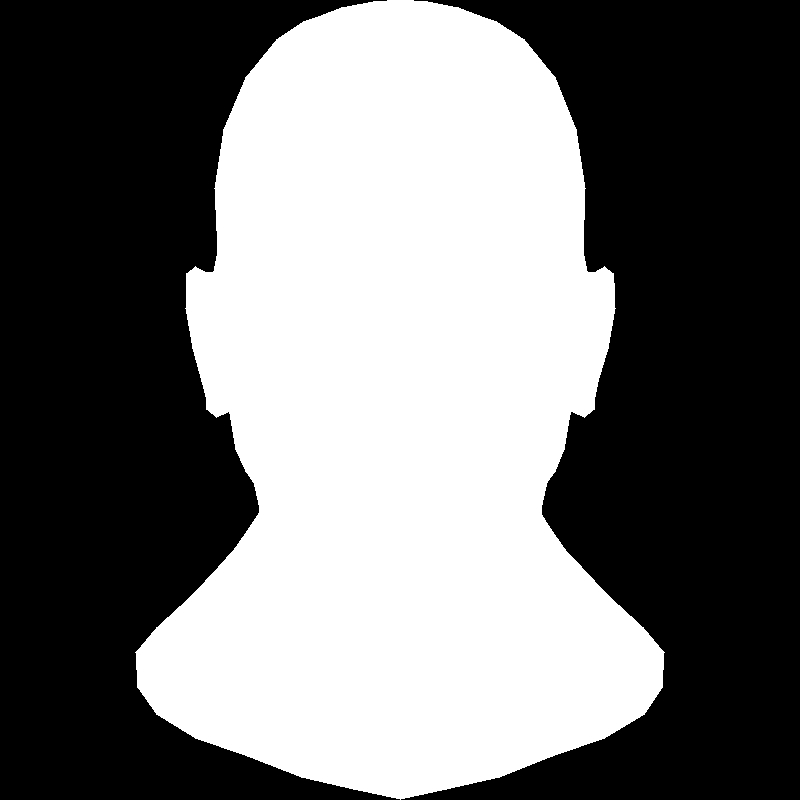
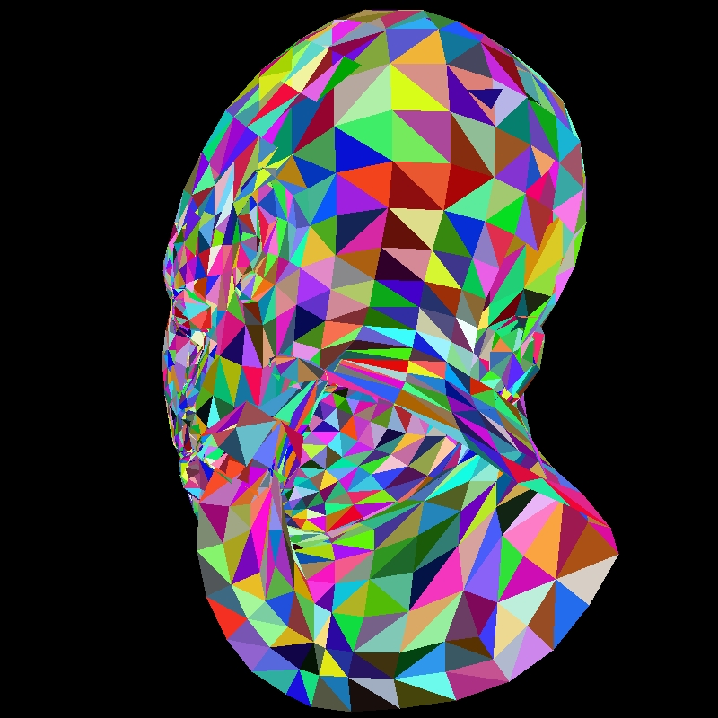
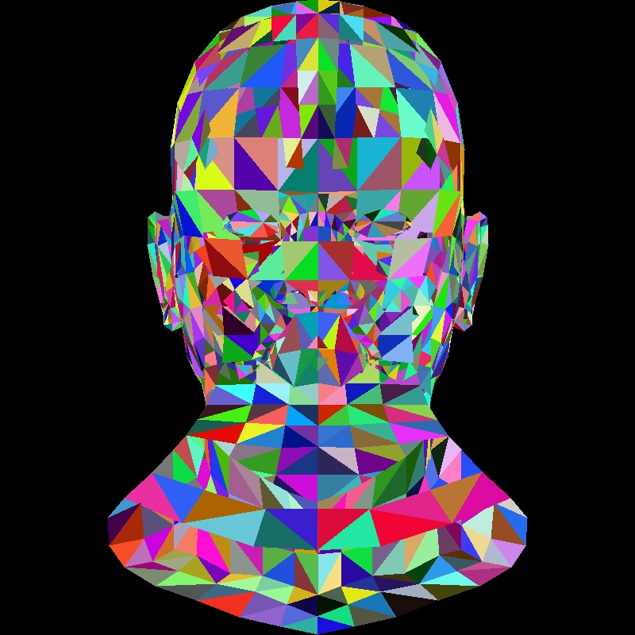
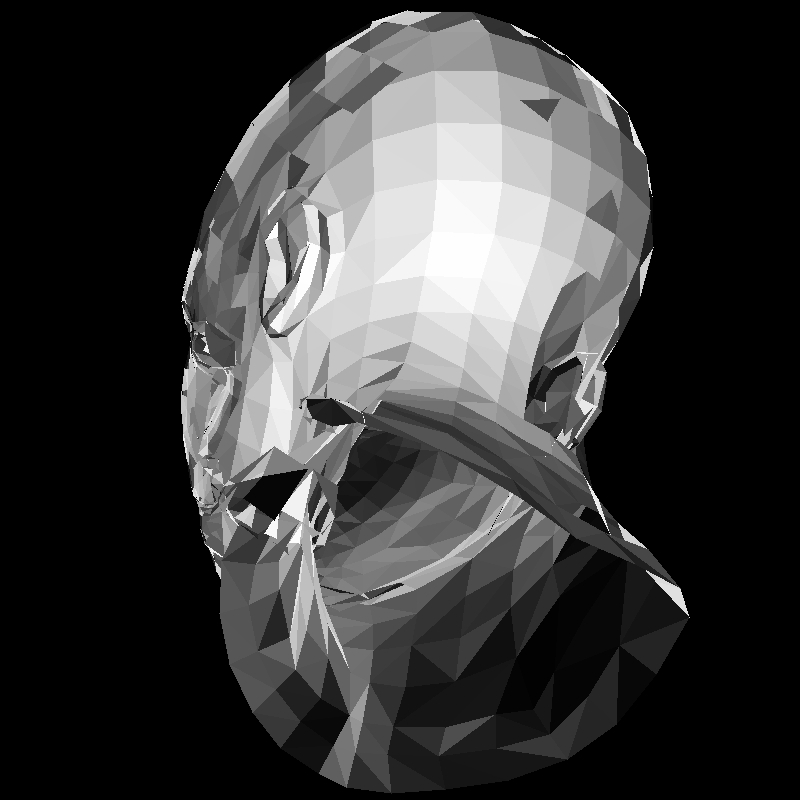
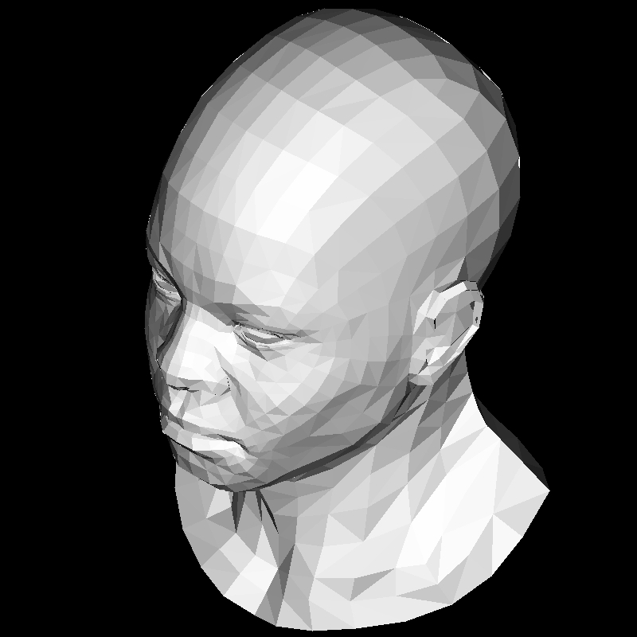

# sszprenderer

> thanks for courses and codes of ssloy
> 
> [ssloy/tinyrenderer: A brief computer graphics / rendering course (github.com)](https://github.com/ssloy/tinyrenderer)

### Directory name rules

`res` is the resource that referred in document files

the main part of name describe briefly what the renderer is.

the `_ref` suffix of the folder with the same folder means one of them is implemented by ssloy, and the other one is implmented by me. they are differenet in code manner and project architecture. for example, I implement view transformation in wireframe_renderer, so that you can look from may position and direction.

### Little Renderer

- wireframe_renderer

> read data from .obj file, and then arrange them into two-vertex pairs and draw line from one vertex to another vertex. repeat the process.
> 
> But if you want to do some view transformation in the process. you should define position, glaze direction, up direction of camera, fill in view transfomation matrix and do matrix multiple for all vertex. After view transformation you'll get new position in camera space. just line them and you'll get the picture after transformation. here is some picture:

- triangle_rasterizer

> this simple rasterizer do not process the z axis, so the later triangle will overlap, so it may looks a little weird. But we will solve the problem by applying z-buffer.
> 
> 
> 
> 
> 
> 
> 
> 

- zbuffer_rasterizer

> Inorder to solve the problem of triangle rasterizer, we use z-buffer algorithm, the fragment that closer to screen (orthograpic projection) will cover the further one that printed before. so use this algorithm we can address the problem of randomly overlapping.
> 
> 

- texture_rasterizer

> okay, let think about how to map the texture to the object surface.
